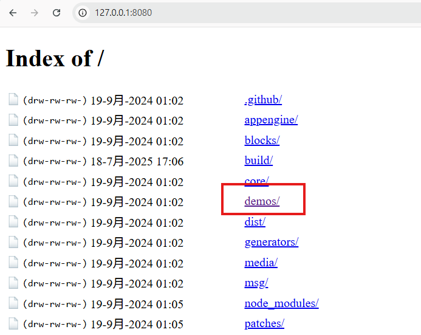
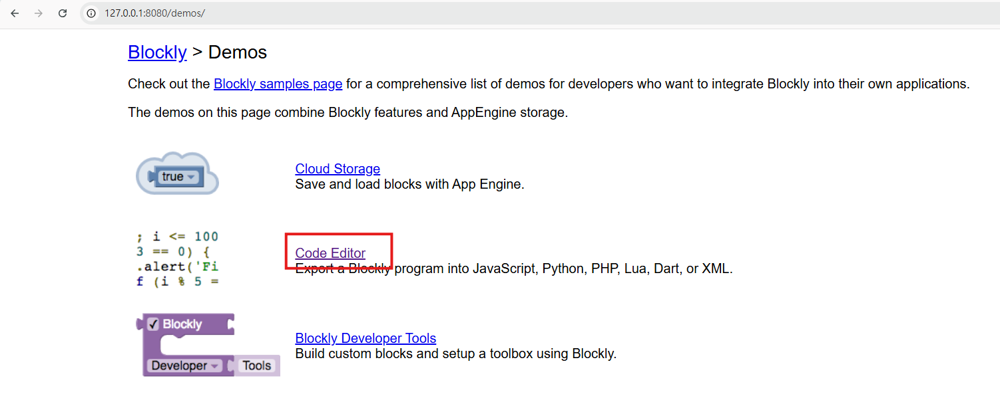
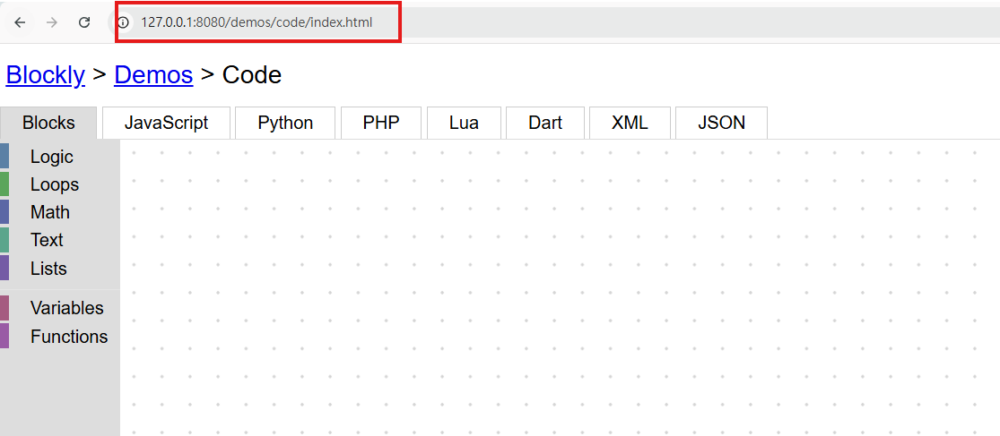

# Code-way setup

## Introduction

本指南將引導您完成設定和運行 Code-way 的步驟。

## Setup Steps

請依照以下步驟設定您的環境並運行 Code-way：

1.  **開啟 `blockly-develop` 資料夾：**
    首先，請導航到您本地機器上儲存 `blockly-develop` 專案的資料夾。您可以使用終端機 (Terminal) 或命令提示字元 (Command Prompt) 進入該資料夾。

    ```bash
    cd path/to/your/blockly-develop
    ```
    （請將 `path/to/your/blockly-develop` 替換為您實際的資料夾路徑）

2.  **啟動開發伺服器：**
    在 `blockly-develop` 資料夾內，執行以下 npm 命令來啟動開發伺服器。這通常會開啟一個本地網頁伺服器，並可能自動在您的瀏覽器中打開一個頁面。

    ```bash
    npm start
    ```

3.  **修改網址：**
    當伺服器啟動後，它可能會在瀏覽器中打開一個預設網址（例如 `http://127.0.0.1:8080/tests/playground.html` 或其他埠號）。請將瀏覽器中的網址改為以下路徑：

    ```
    http://127.0.0.1:8080/demos/code/index.html
    ```
    確保您正確輸入了 IP 位址和埠號，以及 `/demos/code/index.html` 的路徑。
    
    或是手動調整：

    
    
    
    

4. **開啟瀏覽器開發者工具 (F12)：**
    在網頁瀏覽器中，您可以按下 F12 鍵（或右鍵點擊頁面選擇「檢查」/「Inspect」）來開啟開發者工具。這對於調試和檢查網頁元素非常有用。

5.  **貼上檔案：**
    最後，將`程式碼.txt`中的內容複製並貼上。

## 疑難排解 (Troubleshooting)

* 如果 `npm start` 未能啟動伺服器或顯示錯誤，請確保您已安裝 Node.js 和 npm，並且所有專案依賴項都已透過 `npm install` 安裝。